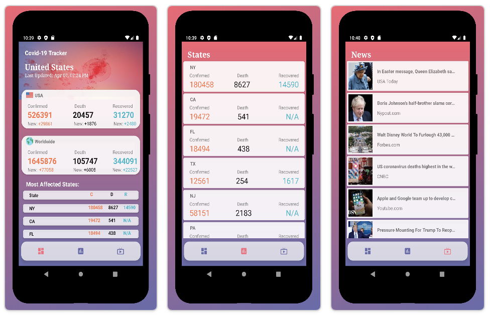

# Covid-19-Tracker

## About
Covid-19 Tracker App - Built with Kotlin Android, the app fetches the latest Covid-19 cases across United States and displays State specific data.

## API
- [The Covid Tracking Project](https://covidtracking.com/api) - The COVID Tracking Project collects and publishes the most complete testing data available for US states and territories.
- [Covid19API](https://covid19api.com/) - A free API for data on the Coronavirus built by Kyle Redelinghuys. Data is sourced from Johns Hopkins CSSE
- [NewsAPI](https://newsapi.org/) - NewsAPI provides breaking news headlines, and search for articles from over 30,000 news sources and blogs.

## Technology Stack
- [Kotlin](https://kotlinlang.org/) - First class and official programming language for Android development.
- [Coroutines](https://kotlinlang.org/docs/reference/coroutines-overview.html) - For asynchronous and more..
- [Android Architecture Components](https://developer.android.com/topic/libraries/architecture) - Collection of libraries that help you design robust, testable, and maintainable apps.
  - [LiveData](https://developer.android.com/topic/libraries/architecture/livedata) - Data objects that notify views when the underlying database changes.
  - [ViewModel](https://developer.android.com/topic/libraries/architecture/viewmodel) - Stores UI-related data that isn't destroyed on UI changes. 
- [Retrofit](https://square.github.io/retrofit/) - A type-safe HTTP client for Android and Java.
- [Gson](https://github.com/google/gson) - A Java serialization/deserialization library to convert Java Objects into JSON and back.
- [Gson Converter](https://github.com/square/retrofit/tree/master/retrofit-converters/gson) - A Converter which uses Gson for serialization to and from JSON.
- [Picasso](https://square.github.io/picasso/) - A powerful image downloading and caching library for Android.
- [Material Components for Android](https://github.com/material-components/material-components-android) - Modular and customizable Material Design UI components for Android.
